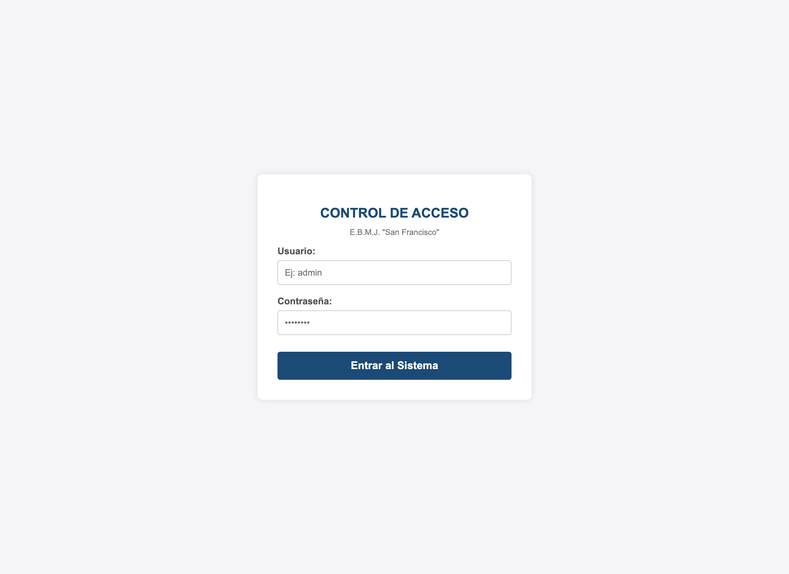
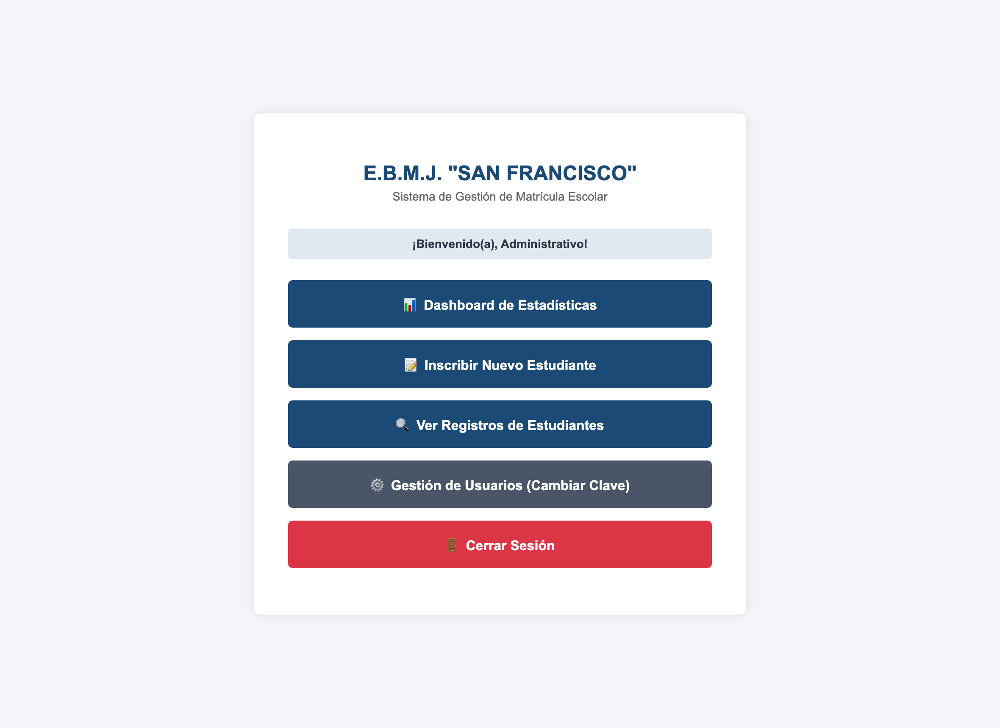
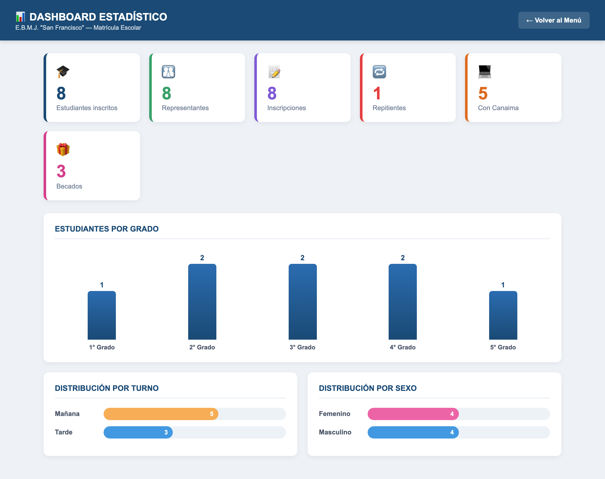
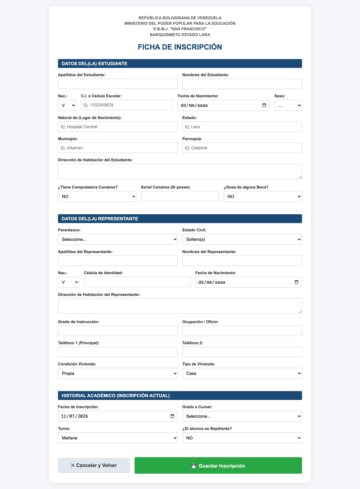
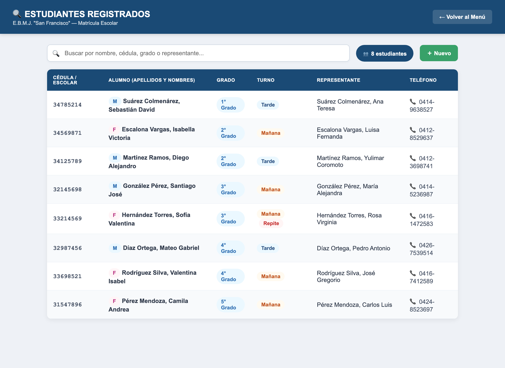
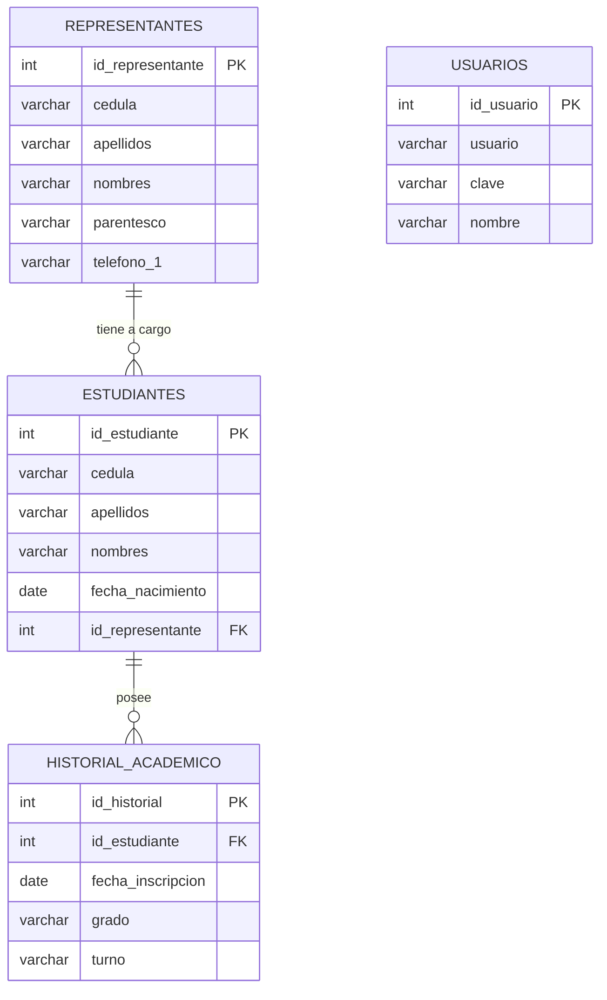

<h1 align="center">📚 Sistema de Gestión de Matrícula Escolar</h1>
<h3 align="center">E.B.M.J. "San Francisco" — Barquisimeto, Estado Lara</h3>

<p align="center">
  <em>Proyecto de Servicio Comunitario</em><br>
  República Bolivariana de Venezuela · Ministerio del Poder Popular para la Educación
</p>

<p align="center">
  
  
  
  
</p>

---

## 📖 Descripción del Proyecto

El **Sistema de Gestión de Matrícula Escolar** es una aplicación web desarrollada como
parte del **Servicio Comunitario** para la Escuela Básica Media Jornada (E.B.M.J.)
**"San Francisco"**, ubicada en Barquisimeto, estado Lara.

Su propósito es **digitalizar el proceso de inscripción de estudiantes**, que hasta ahora
se realizaba de forma manual con planillas de papel. El sistema permite al personal
administrativo registrar, almacenar y consultar de manera rápida, ordenada y segura los
datos de los estudiantes, sus representantes y su historial académico, reduciendo el uso
de papel, evitando la pérdida de información y agilizando la búsqueda de registros.

> Este proyecto representa la aplicación práctica de los conocimientos adquiridos durante
> la carrera, puestos al servicio de una necesidad real de la comunidad educativa.

---

## 🎯 Objetivos

### Objetivo General
Desarrollar un sistema web que permita automatizar el proceso de inscripción y control de
matrícula de los estudiantes de la E.B.M.J. "San Francisco".

### Objetivos Específicos
- ✅ Sustituir el registro manual en papel por una **ficha de inscripción digital**.
- ✅ Almacenar de forma **centralizada y segura** los datos del estudiante, del
  representante y del historial académico.
- ✅ Permitir la **consulta rápida** de los estudiantes inscritos.
- ✅ Proteger el acceso al sistema mediante un **control de usuarios con contraseña**.
- ✅ Evitar registros duplicados validando la **cédula / código escolar**.

---

## 🤝 Contexto del Servicio Comunitario

Este sistema fue construido por un equipo de **cuatro (4) estudiantes** como trabajo de
servicio comunitario. El proyecto abarcó las siguientes fases:

1. **Diagnóstico:** se identificó que la escuela realizaba las inscripciones a mano, lo
   que generaba demoras, errores y riesgo de pérdida de las planillas.
2. **Planificación:** se diseñó la base de datos y las pantallas del sistema.
3. **Desarrollo:** se programaron los módulos en PHP y se creó la base de datos en MySQL.
4. **Implementación y pruebas:** se instaló y probó el sistema con datos reales de la
   institución.

> 📄 El guión de la defensa, dividido en cuatro partes (una por estudiante), está
> disponible en **[GUION_DEFENSA.md](GUION_DEFENSA.md)**.

---

## ✨ Características Principales

| Módulo | Descripción |
|--------|-------------|
| 🔐 **Control de Acceso** | Inicio de sesión con usuario y contraseña. Solo el personal autorizado entra al sistema. |
| 🏠 **Panel de Control (Menú)** | Pantalla central con acceso a todas las funciones del sistema. |
| 📊 **Dashboard de Estadísticas** | Muestra indicadores y gráficos de la matrícula (por grado, turno y sexo) que se actualizan solos. |
| 📝 **Ficha de Inscripción** | Formulario completo con los datos del estudiante, del representante y del historial académico. |
| 💾 **Registro Seguro** | Guarda la información en la base de datos, validando que la cédula no esté duplicada. |
| 🔍 **Consulta de Estudiantes** | Lista todos los alumnos inscritos con **buscador en vivo** y etiquetas de color. |
| ⚙️ **Gestión de Usuarios** | Permite al administrador cambiar su contraseña de forma segura. |
| 🚪 **Cierre de Sesión** | Cierra la sesión de forma segura al terminar. |

---

## 🛠️ Tecnologías Utilizadas

| Tecnología | Uso en el proyecto |
|------------|--------------------|
| **PHP** | Lenguaje del lado del servidor. Procesa los formularios y se comunica con la base de datos. |
| **MySQL / MariaDB** | Sistema gestor de base de datos donde se almacena toda la información. |
| **HTML5** | Estructura de las páginas y los formularios. |
| **CSS3** | Diseño y estilo visual de la aplicación (colores institucionales, tablas, botones). |
| **MySQLi (Prepared Statements)** | Extensión de PHP para consultas seguras a la base de datos. |
| **Sesiones (Sessions)** | Mantienen al usuario identificado mientras usa el sistema. |
| **Apache (XAMPP)** | Servidor web local sobre el que corre la aplicación. |

---

## 🖼️ Capturas de Pantalla

### 🔐 Inicio de sesión y Menú Principal

<p align="center">
  
  &nbsp;
  
</p>

### 📊 Dashboard de Estadísticas

<p align="center">
  
</p>

### 📝 Ficha de Inscripción y 🔍 Consulta de Estudiantes

<p align="center">
  
  &nbsp;
  
</p>

> 📘 **¿Cómo se usa cada pantalla?** Consulta el
> **[Manual de Usuario paso a paso](docs/MANUAL_USUARIO.md)**, con todas las capturas y las
> instrucciones detalladas.

---

## 📂 Estructura del Proyecto

```
registro_san_francisco/
│
├── conexion.php            # Conexión a la base de datos MySQL
├── login.php               # Pantalla de inicio de sesión
├── menu.php                # Panel de control / menú principal
├── dashboard.php           # Dashboard de estadísticas (indicadores y gráficos)
├── index.php               # Ficha de inscripción (formulario)
├── guardar.php             # Procesa y guarda la inscripción en la BD
├── consultar.php           # Lista de estudiantes registrados (con buscador)
├── gestion_usuarios.php    # Cambio de contraseña del usuario
├── salir.php               # Cierre de sesión
│
├── escuelasanfrancisco.sql # Estructura y datos de la base de datos
│
├── README.md               # Este documento
├── GUION_DEFENSA.md        # Guión de la defensa (4 partes)
└── docs/                   # Documentación
    ├── MANUAL_USUARIO.md   # Manual de uso paso a paso (con capturas)
    └── capturas/           # Imágenes de las pantallas del sistema
```

---

## 🗄️ Estructura de la Base de Datos

La base de datos `escuelasanfrancisco` está compuesta por **cuatro tablas** relacionadas
entre sí:

| Tabla | Función |
|-------|---------|
| `usuarios` | Guarda las cuentas del personal que puede acceder al sistema. |
| `representantes` | Datos del padre, madre o representante del estudiante. |
| `estudiantes` | Datos personales de cada alumno. Se relaciona con su representante. |
| `historial_academico` | Datos de la inscripción (grado, turno, fecha, si repite). Se relaciona con el estudiante. |

### Diagrama de relaciones



> **Relaciones clave:** un representante puede tener varios estudiantes a su cargo, y un
> estudiante puede tener uno o varios registros de historial académico (por cada año que
> se inscribe). Las relaciones usan `ON DELETE CASCADE`: si se elimina un estudiante,
> también se elimina automáticamente su historial.

---

## 💻 Requisitos

- **XAMPP** (o cualquier servidor con **Apache + PHP 7 u 8 + MySQL/MariaDB**).
- Un navegador web (Google Chrome, Firefox, Edge, etc.).

---

## 🚀 Instalación y Configuración (con XAMPP)

1. **Instalar XAMPP** y encender los módulos **Apache** y **MySQL** desde el panel de
   control.

2. **Copiar el proyecto** dentro de la carpeta `htdocs` de XAMPP:
   ```
   C:\xampp\htdocs\registro_san_francisco
   ```

3. **Crear la base de datos:**
   - Abrir el navegador e ir a `http://localhost/phpmyadmin`.
   - Crear una base de datos llamada **`escuelasanfrancisco`**.
   - Entrar a la pestaña **Importar** y seleccionar el archivo
     [`escuelasanfrancisco.sql`](escuelasanfrancisco.sql).
   - Pulsar **Continuar** para cargar las tablas.

4. **Verificar la conexión** en [`conexion.php`](conexion.php) (los valores por defecto de
   XAMPP ya vienen configurados):
   ```php
   $servidor   = "localhost";
   $usuario    = "root";
   $clave      = "";           // En XAMPP la clave por defecto viene vacía
   $base_datos = "escuelasanfrancisco";
   ```

5. **Abrir el sistema** en el navegador:
   ```
   http://localhost/registro_san_francisco/login.php
   ```

6. *(Opcional)* **Cargar datos de ejemplo** para la demostración/defensa: importar el
   archivo [`docs/datos_ejemplo.sql`](docs/datos_ejemplo.sql) desde phpMyAdmin. Esto agrega
   8 estudiantes de prueba para que el dashboard y la consulta se vean con contenido.
   > ⚠️ Este archivo **borra los registros existentes** de estudiantes antes de cargar los
   > de ejemplo. Úsalo solo en un sistema de práctica, no con datos reales de la escuela.

---

## 🔑 Uso del Sistema

**Credenciales de acceso por defecto:**

| Usuario | Contraseña |
|---------|-----------|
| `admin` | `6789` |

**Flujo de trabajo:**

1. Ingresar con el usuario y la contraseña en la pantalla de **login**.
2. Desde el **menú**, elegir la acción deseada:
   - **📊 Dashboard de Estadísticas** → ver los indicadores y gráficos de la matrícula.
   - **📝 Inscribir Nuevo Estudiante** → completar la ficha y guardar.
   - **🔍 Ver Registros de Estudiantes** → consultar la lista de inscritos (con buscador).
   - **⚙️ Gestión de Usuarios** → cambiar la contraseña.
3. Al finalizar, usar **🚪 Cerrar Sesión** para salir de forma segura.

> 📘 Para instrucciones detalladas de cada pantalla, consulta el
> **[Manual de Usuario](docs/MANUAL_USUARIO.md)**.

---

## 🔒 Seguridad Implementada

El sistema incorpora varias medidas de protección:

- **Consultas preparadas (Prepared Statements):** evitan la inyección de código malicioso
  en la base de datos (SQL Injection).
- **Control de sesiones:** ninguna página interna puede abrirse sin haber iniciado sesión;
  el sistema redirige automáticamente al login.
- **Validación de duplicados:** no permite registrar dos estudiantes con la misma cédula o
  código escolar.
- **Escape de datos (`htmlspecialchars`):** protege la salida de información al mostrar los
  registros, evitando ataques de tipo XSS.
- **Codificación UTF-8 (utf8mb4):** garantiza que los acentos y la letra "ñ" se guarden
  correctamente.

---

## 🎤 Defensa del Proyecto

El proyecto fue defendido por un equipo de cuatro estudiantes. Cada integrante desarrolla
una parte de la presentación:

| # | Estudiante | Responsabilidad |
|---|-----------|-----------------|
| 1️⃣ | **Apertura** | Presenta al grupo y da a conocer el proyecto (qué es, el problema y los objetivos). |
| 2️⃣ | **Desarrollo técnico** | Explica el trabajo realizado y el funcionamiento interno del sistema. |
| 3️⃣ | **Recorrido y tecnologías** | Muestra el sistema por dentro y las tecnologías utilizadas. |
| 4️⃣ | **Demostración y cierre** | Realiza una demostración en vivo, las conclusiones y el cierre. |

👉 **El guión completo y detallado de cada parte está en [GUION_DEFENSA.md](GUION_DEFENSA.md).**

---

## 👥 Autores

Proyecto de Servicio Comunitario desarrollado por un equipo de cuatro (4) estudiantes para
la **E.B.M.J. "San Francisco"**, Barquisimeto, estado Lara.

---

## 📄 Licencia

Proyecto desarrollado con fines **académicos y sociales** para la comunidad educativa de la
E.B.M.J. "San Francisco". Su uso está destinado a la gestión interna de la institución.
