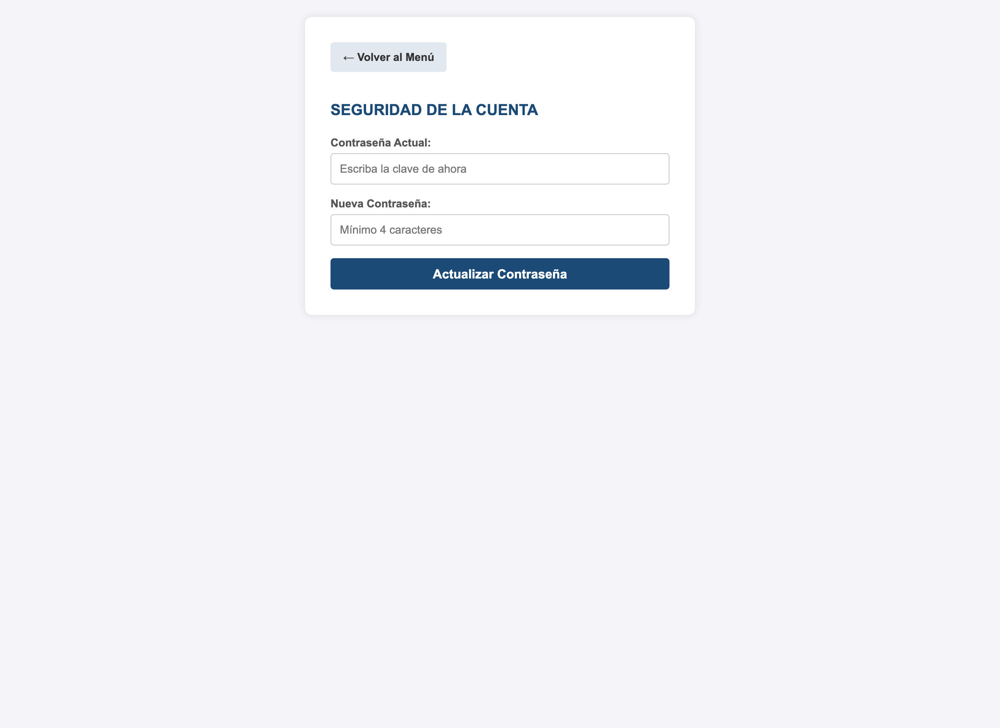

<h1 align="center">📘 Manual de Usuario</h1>
<h3 align="center">Sistema de Gestión de Matrícula Escolar — E.B.M.J. "San Francisco"</h3>

<em>Guía paso a paso para el personal administrativo de la institución.</em>

---

## 📑 Índice

1. [¿Qué es este sistema?](#1-qué-es-este-sistema)
2. [Cómo iniciar sesión](#2-cómo-iniciar-sesión)
3. [El Menú Principal](#3-el-menú-principal)
4. [Dashboard de Estadísticas](#4-dashboard-de-estadísticas)
5. [Inscribir un Nuevo Estudiante](#5-inscribir-un-nuevo-estudiante)
6. [Consultar los Estudiantes Registrados](#6-consultar-los-estudiantes-registrados)
7. [Cambiar la Contraseña](#7-cambiar-la-contraseña)
8. [Cerrar Sesión](#8-cerrar-sesión)
9. [Preguntas Frecuentes](#9-preguntas-frecuentes)

---

## 1. ¿Qué es este sistema?

Es una aplicación web que permite **registrar y consultar la matrícula de los estudiantes**
de la escuela de forma digital, sustituyendo las planillas de papel. Con él, el personal
administrativo puede inscribir alumnos, ver estadísticas y encontrar cualquier registro en
segundos.

> 💡 **No necesita internet.** El sistema funciona de forma local en la computadora de la
> escuela donde esté instalado.

---

## 2. Cómo iniciar sesión

Al abrir el sistema, aparece la pantalla de **Control de Acceso**.

**Pasos:**
1. Escriba su **Usuario** (por defecto: `admin`).
2. Escriba su **Contraseña** (por defecto: `6789`).
3. Presione el botón **"Entrar al Sistema"**.

> ⚠️ Si los datos son incorrectos, el sistema mostrará un mensaje en rojo indicando el
> error. Verifique que no haya espacios de más y vuelva a intentarlo.

---

## 3. El Menú Principal

Después de iniciar sesión, verá el **Panel de Control**. Desde aquí se accede a todas las
funciones del sistema.

| Botón | ¿Qué hace? |
|-------|-----------|
| 📊 **Dashboard de Estadísticas** | Muestra los números y gráficos de la matrícula. |
| 📝 **Inscribir Nuevo Estudiante** | Abre la ficha para registrar un alumno nuevo. |
| 🔍 **Ver Registros de Estudiantes** | Muestra la lista de todos los inscritos. |
| ⚙️ **Gestión de Usuarios** | Permite cambiar su contraseña. |
| 🚪 **Cerrar Sesión** | Sale del sistema de forma segura. |

---

## 4. Dashboard de Estadísticas

El **Dashboard** ofrece un resumen visual e inmediato de la matrícula de la escuela.

**¿Qué información muestra?**

- **Tarjetas superiores (indicadores):** total de estudiantes inscritos, representantes,
  inscripciones, alumnos repitientes, estudiantes con Canaima y estudiantes becados.
- **Gráfico "Estudiantes por Grado":** compara cuántos alumnos hay en cada grado (de 1° a 6°).
- **"Distribución por Turno":** cuántos estudiantes asisten en la mañana y cuántos en la tarde.
- **"Distribución por Sexo":** cuántos alumnos son de sexo femenino y masculino.

> 💡 Los números se **actualizan automáticamente** cada vez que se registra un nuevo
> estudiante. No hay que calcular nada a mano.

---

## 5. Inscribir un Nuevo Estudiante

Al pulsar **"Inscribir Nuevo Estudiante"**, se abre la **Ficha de Inscripción**, dividida en
tres secciones.

**Secciones de la ficha:**

1. **Datos del(la) Estudiante:** apellidos, nombres, cédula/código escolar, fecha de
   nacimiento, sexo, lugar de nacimiento, dirección, si tiene Canaima y si goza de beca.
2. **Datos del(la) Representante:** parentesco, nombres, cédula, dirección, teléfonos y
   datos de la vivienda.
3. **Historial Académico:** grado a cursar, turno, fecha de inscripción y si el alumno es
   repitiente.

**Pasos para inscribir:**
1. Complete todos los campos marcados como obligatorios.
2. Revise que la información esté correcta.
3. Presione el botón verde **"💾 Guardar Inscripción"**.
4. El sistema confirmará con el mensaje **"¡Inscripción Guardada con Éxito!"**.

> ⚠️ **Cédula duplicada:** si intenta inscribir a un estudiante con una cédula/código escolar
> que ya existe, el sistema **lo impedirá** y mostrará una alerta. Esto evita registros
> repetidos.
>
> ✅ Si se equivocó, puede usar el botón **"✕ Cancelar y Volver"** para regresar al menú sin
> guardar.

---

## 6. Consultar los Estudiantes Registrados

La opción **"Ver Registros de Estudiantes"** muestra la lista completa de alumnos inscritos.

**Funciones de esta pantalla:**

- **Buscador en vivo:** escriba en la barra superior el nombre, cédula, grado o
  representante y la lista se **filtra automáticamente** mientras escribe.
- **Contador:** indica cuántos estudiantes hay registrados en total.
- **Etiquetas de color:** el grado, el turno y el sexo se muestran con etiquetas para
  identificarlos rápidamente. Los alumnos repitientes tienen una etiqueta roja **"Repite"**.
- **Botón "＋ Nuevo":** lleva directamente a la ficha de inscripción.

> 💡 **Ejemplo:** para ver solo los alumnos de 3° grado, escriba `3°` en el buscador y la
> tabla mostrará únicamente esos estudiantes.

---

## 7. Cambiar la Contraseña

En **"Gestión de Usuarios"** puede cambiar la contraseña de acceso al sistema.

**Pasos:**
1. Escriba su **contraseña actual**.
2. Escriba la **nueva contraseña**.
3. Presione **"Actualizar Contraseña"**.
4. El sistema confirmará el cambio con un mensaje verde.

> ⚠️ Guarde su nueva contraseña en un lugar seguro. Si la contraseña actual que escribe es
> incorrecta, el sistema no permitirá el cambio.

---

## 8. Cerrar Sesión

Al terminar de usar el sistema, presione siempre **"🚪 Cerrar Sesión"** desde el menú. Esto
protege la información para que nadie más pueda usar el sistema con su cuenta.

---

## 9. Preguntas Frecuentes

**❓ Olvidé mi contraseña, ¿qué hago?**
Debe pedir al encargado técnico que la restablezca directamente en la base de datos.

**❓ El sistema no abre / da error de conexión.**
Verifique que **XAMPP** esté encendido, con los módulos **Apache** y **MySQL** en verde.

**❓ ¿Puedo usarlo desde el celular?**
Sí, las pantallas se adaptan a pantallas pequeñas, siempre que el celular esté conectado a
la misma red de la computadora donde corre el sistema.

**❓ ¿Se pierde la información si apago la computadora?**
No. Toda la información queda guardada de forma permanente en la base de datos.

---

  <a href="../README.md">← Volver al README</a> ·
  <a href="../GUION_DEFENSA.md">Ver Guión de Defensa →</a>

